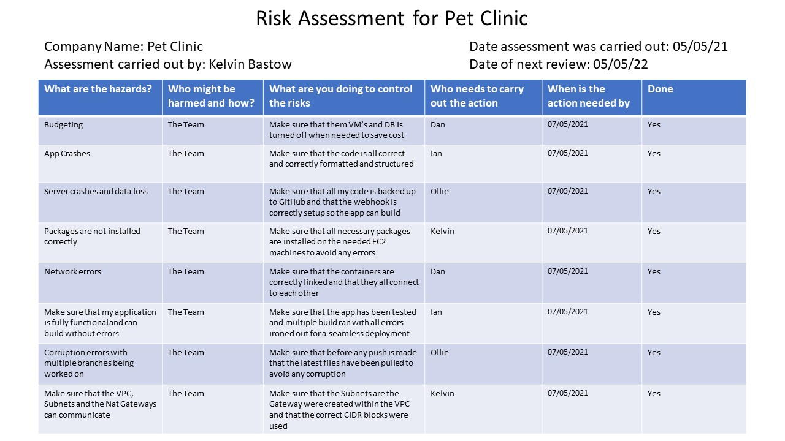

# Final project

This was a group challenge to see how well we can apply the knowledge we have gained over the last 10 weeks within the given time constraints to deploy a prebuilt application using technologies including Terraform, Kubernetes, Docker, Jenkins, and AWS.

One of the purposes of this project was for us to experience working to complete a deliverable as part of a team, this experience will be invaluable for your future interviews with clients.

# Requirements

You will need to plan, design, and implement a solution for automating the development workflows and deployments of this application. As part of your final deliverable, you will need to discuss the project in a presentation and demonstrate these workflows.

What tools will work for you best? For example: Terraform, Kubernetes, Ansible etc. There is no restrictions or requirements on which ones to use; you should decide which you feel are most appropriate and justify their use.

Multiple Environment support: How can a developer test their new features on an environment before merging their changes to the main branch?

How can changes on the GitHub repository automatically build and deploy to testing and live environments?

Running costs. What are your monthly estimates? How could they be improved?

# Trello Board

My trello board progression, with a link to the most recent version [here][MyTrello]!!

This shows you my backlog of tasks, what is currently being worked on and also what has been completed.

[MyTrello]: https://trello.com/b/0i1GmcuQ/final-project

# Pipeline

Here is an Image of our pipeline, this diagram shows how we have organised the repo and then how one the application files have been pushed to main how they then filter through the said technologies we have used.

The pipeline is automated with a Webhook from github and integrated using a Jenkinsfile, from there we use docker commands, docker-compose for a unified configuration, docker swarm for deployment and Ansible for configuration management.

# Risk Assessment

Here is our risk assessments deatailing all the risks that have and will be encountered during this project.

# Refrences
