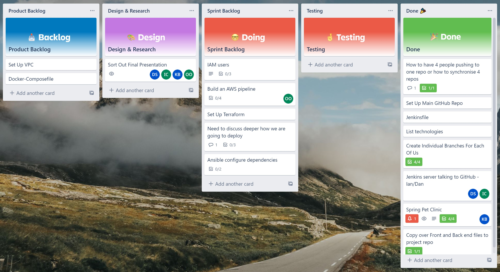
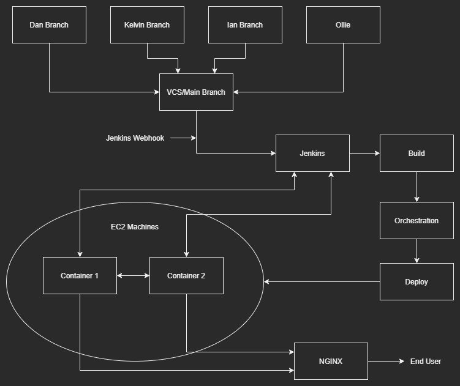

# Final project

Text

# Requirements

Text

# Test Analysis 

Text

# Tech Stack used

Text

# Trello Board

This is a link to my [Trello][MyTrello]! Board:

[MyTrello]: https://trello.com/b/0i1GmcuQ/final-project

# Database 

# Pipeline

Here is an Image of our pipeline

# CI/CD pipeline

The pipeline is automated with a Webhook from github and integrated using a Jenkinsfile, from there we use docker commands, docker-compose for a unified configuration, docker swarm for deployment and Ansible for configuration management. 

It follows this steps:

# Risk Analysis

| Description |Evaluation| Likelihood  | Impact Level | Responsability |  Response  |  Control Measures  
| :---        | :----:   |  :----:     |  :----:      |  :----:        |  :----:    |---:
| Description |Evaluation| Likelihood  | Impact Level | Responsability |  Response  |  Control Measures  

# Acknowledgements and contributions
